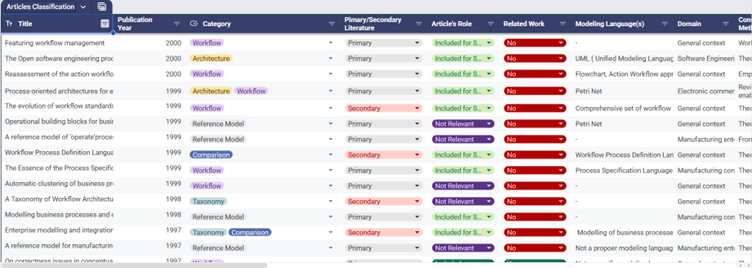

## 📚 Systematic Literature Review (SLR)

This folder includes the following main files:

* **SLR Results**
* **Additional Phase for Inclusion**
* **Articles' Classification**

## 🔍 SLR Results

**SLR Results** shows outputs collected from the search engines which give the names to the following tabs in the file:

* `Google Scholar`
* `ACM_Title`, `ACM_Abstract`, `ACM_Keywords`
* `Scopus_Article Title`
* `IEEE_Doc Title`, `IEEE_Abstract`, `IEEE_AuthorKeyword`
* `Springer_Title`
* `Total Merge` that combines together the various outputs 
* `Total Merge NoDup` shows the overall results minus the duplicated considering the titles and year of publication
* `Total Merge NoDupEx` depicts the same results of the previous tab with the additional information provided by the columns named `Exclusion Criterion` and `Details (Inclusion/Exclusion)`. Indeed, there is evidence that not only a decision for inclusion and exclusion criteria application has been taken but also a specific rationale for each of the results has been declared and thus can be consulted.

## ➕ Additional Phase for Inclusion

**Additional Phase for Inclusion** depicts further reflections upon the included results that should be actually retained. This file contains the following sheets:

* `Total Merge NoDupEx` with the same results of the **SLR Results** file, to ensure continuity.
* `Filter_on_I1` returns with respect to the previous tab only the articles marked as I1, thus the ones which are included according to the inclusion and exclusion criteria.
* `Included_Additional Phase` registers the application of a second phase of inclusion and exclusion criteria to include only the truly relevant papers, considering not only title and abstract but looking at the full content. 
* `Included` shows only the included papers at the end of this second phase of analysis.

## 🏷️ Articles' Classification

**Articles' Classification** has been designed with the precise intention to classify only the retained papers, resulting from the very last stage of our analysis and thus the ones contained in the `Included` tab of **Additional Phase for Inclusion** file. The structure of this file is presented with the following columns:

* `Title`
* `Publication Year`
* `Category`, according to which the examined paper could be classified with pre-established keywords: `Reference Model`, `Comparison`, `Workflow`, `Taxonomy`, `Architecture`, `Business Process`.
* `Primary/Secondary Literature`
* `Article's Role` choosing between `Included for SoA`, `Included`, `Not Relevant` since even after the second phase for inclusion some further articles could be deleted from consideration as not truly in scope with respect to the intended research direction.
* `Related Work` (`Yes` / `No`)
* `Modeling Language(s)`
* `Domain` gives an insight for general or specific domain context like manufacturing or software engineering domain.
* `Construction Method` aims mainly to derive if the proposed solution is theoretically or empirically based.
* `Evaluation` details if this section is present in the work, giving a reflection point for eventual validity of the suggested approach.
* `Tool Support` declares if a tool is recommended or developed as support for the solution.
* `Use Case` annotates the presence and eventual details concerning the use cases.
* `Note` is a general information column that summarizes main information of the paper under analysis.
* `Attention` is a column used only for some particular articles which are considered particularly relevant.

The used classification has been customized starting from the one already proposed by a survey and classification conducted on Business Process Reference Models in the literature [1].

## 📖 Reference

[1] Fettke, P., Loos, P., Zwicker, J. *Business Process Reference Models: Survey and Classification*. In: International Conference on Business Process Management, pp. 469–483. Springer (2005)
